# Documentación Técnica Completa
## Gestor de Eventos Locales

**Autor:** Martin Peñalva Artázcoz  
**Versión:** 1.0.0  
**Fecha:** 2024

---

## Tabla de Contenidos

1. [Introducción](#1-introducción)
2. [Arquitectura del Sistema](#2-arquitectura-del-sistema)
3. [Estructura del Proyecto](#3-estructura-del-proyecto)
4. [Documentación de Módulos](#4-documentación-de-módulos)
   - [4.1. Punto de Entrada Principal](#41-punto-de-entrada-principal)
   - [4.2. Configuración](#42-configuración)
   - [4.3. Base de Datos](#43-base-de-datos)
   - [4.4. Modelos de Datos](#44-modelos-de-datos)
   - [4.5. Controladores](#45-controladores)
   - [4.6. Vistas (Interfaz Gráfica)](#46-vistas-interfaz-gráfica)
   - [4.7. Utilidades](#47-utilidades)
5. [Gestión de Concurrencia](#5-gestión-de-concurrencia)
6. [Base de Datos](#6-base-de-datos)
7. [Instalación y Configuración](#7-instalación-y-configuración)
8. [Uso de la Aplicación](#8-uso-de-la-aplicación)

---

## 1. Introducción

### 1.1. Descripción General

El **Gestor de Eventos Locales** es una aplicación de escritorio desarrollada en Python que permite la gestión centralizada de eventos, participantes e inscripciones. La aplicación está diseñada para soportar múltiples usuarios simultáneos con un sistema avanzado de gestión de concurrencia.

### 1.2. Características Principales

- ✅ CRUD completo de eventos, participantes y usuarios
- ✅ Sistema de inscripciones de participantes a eventos
- ✅ Búsqueda y filtrado avanzado
- ✅ Exportación de datos a CSV y PDF
- ✅ **Soporte multiusuario simultáneo** con gestión avanzada de concurrencia
- ✅ Interfaz gráfica intuitiva desarrollada con Tkinter
- ✅ Autenticación y autorización basada en roles (admin/user)

### 1.3. Tecnologías Utilizadas

- **Lenguaje:** Python 3.8+
- **Interfaz Gráfica:** Tkinter
- **Base de Datos:** MySQL 8.0+
- **Gestión de Contraseñas:** bcrypt
- **Exportación PDF:** ReportLab
- **Gestión de Configuración:** python-dotenv

---

## 2. Arquitectura del Sistema

### 2.1. Patrón de Arquitectura

La aplicación sigue una arquitectura **MVC (Modelo-Vista-Controlador)** con las siguientes capas:

```
┌─────────────────────────────────────────┐
│         CAPA DE PRESENTACIÓN            │
│         (Vistas - Tkinter)              │
└─────────────────────────────────────────┘
                  ↕
┌─────────────────────────────────────────┐
│         CAPA DE LÓGICA                  │
│         (Controladores)                 │
└─────────────────────────────────────────┘
                  ↕
┌─────────────────────────────────────────┐
│         CAPA DE DATOS                   │
│         (Modelos + Base de Datos)       │
└─────────────────────────────────────────┘
```

**[IMAGEN: diagrama_arquitectura.png]**  
*Diagrama de arquitectura MVC del sistema. Mostrar las tres capas principales y sus interacciones.*

### 2.2. Flujo de Datos

El flujo de datos en la aplicación sigue este patrón:

1. **Usuario interactúa** con la interfaz (Vista)
2. **Vista** llama al Controlador correspondiente
3. **Controlador** valida y procesa la lógica de negocio
4. **Controlador** accede a la Base de Datos a través de los Modelos
5. **Resultado** se devuelve a la Vista para mostrar al usuario

**[IMAGEN: diagrama_flujo_datos.png]**  
*Diagrama de flujo de datos mostrando la interacción entre Vista, Controlador y Modelo.*

---

## 3. Estructura del Proyecto

```
prueba-PP-master/
├── src/                          # Código fuente principal
│   ├── main.py                  # Punto de entrada de la aplicación
│   ├── models/                  # Modelos de datos
│   │   ├── user.py              # Modelo de Usuario
│   │   ├── event.py             # Modelo de Evento
│   │   └── participant.py      # Modelo de Participante
│   ├── controllers/             # Controladores (lógica de negocio)
│   │   ├── auth_controller.py   # Controlador de autenticación
│   │   ├── event_controller.py  # Controlador de eventos
│   │   ├── participant_controller.py
│   │   ├── registration_controller.py
│   │   └── user_controller.py
│   ├── views/                   # Vistas (interfaz gráfica)
│   │   ├── main_window.py      # Ventana principal
│   │   ├── login_window.py     # Ventana de login
│   │   ├── event_view.py        # Vista de eventos
│   │   ├── participant_view.py
│   │   ├── registration_view.py
│   │   ├── user_view.py
│   │   ├── reports_view.py
│   │   └── styles.py           # Estilos y colores
│   ├── database/                # Gestión de base de datos
│   │   └── db_connection.py    # Conexión y pool de conexiones
│   └── utils/                   # Utilidades
│       ├── validators.py        # Validación de datos
│       ├── exporters.py        # Exportación CSV/PDF
│       └── concurrency_manager.py  # Gestión de concurrencia
├── config/                      # Configuración
│   └── config.py               # Configuración de la aplicación
├── database/                    # Scripts SQL
│   └── schema.sql              # Esquema de base de datos
├── tests/                       # Pruebas unitarias
├── exports/                     # Archivos exportados
├── requirements.txt            # Dependencias Python
└── README.md                   # Documentación básica
```

**[IMAGEN: estructura_proyecto.png]**  
*Captura de pantalla del explorador de archivos mostrando la estructura completa del proyecto.*

---

## 4. Documentación de Módulos

### 4.1. Punto de Entrada Principal

#### 4.1.1. `src/main.py`

Este archivo contiene la clase principal `App` que inicializa la aplicación y gestiona el ciclo de vida.

**[IMAGEN: src/main.py - líneas 1-30]**  
*Captura del inicio del archivo mostrando los imports y la clase App.*

**Descripción:**
- Gestiona la inicialización de la aplicación
- Configura el icono de la ventana
- Maneja el flujo de login y logout
- Crea y gestiona la ventana principal

**Código Clave:**

```python
class App:
    """Clase principal de la aplicación"""
    
    def __init__(self):
        self.root = tk.Tk()
        self.db = None
        self.username = None
        self.main_window = None
        self.setup_icon()
```

**[IMAGEN: src/main.py - líneas 22-30]**  
*Captura mostrando el constructor de la clase App.*

**Métodos Principales:**

1. **`start()`** (líneas 64-88): Inicia la aplicación mostrando la ventana de login
   - 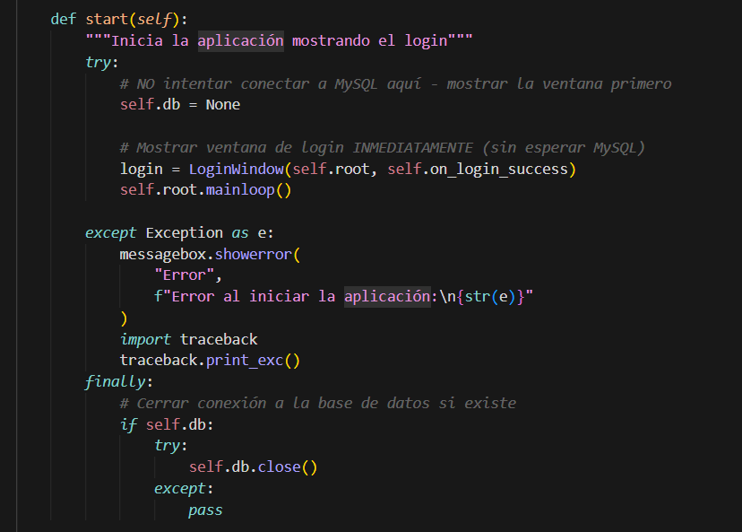  
    *Captura del método start() completo.*

2. **`on_login_success()`** (líneas 108-157): Callback cuando el login es exitoso
   - 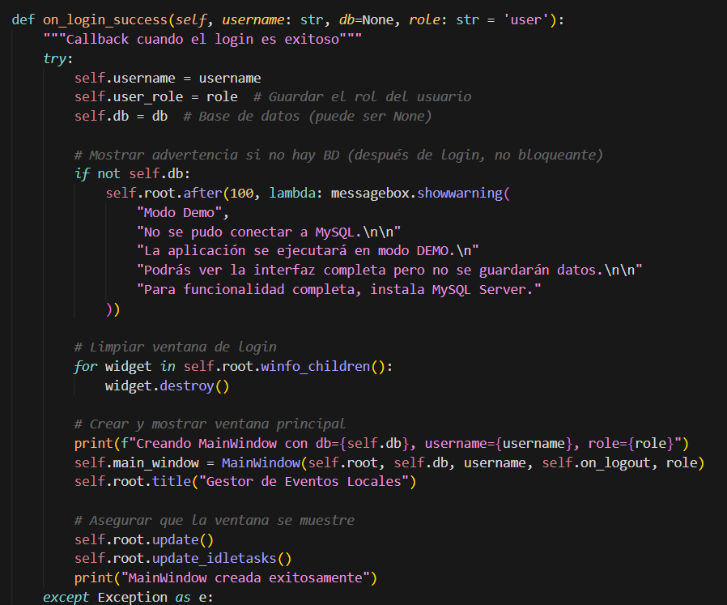  
    *Captura del método on_login_success() mostrando la creación de MainWindow.*

3. **`setup_icon()`** (líneas 32-62): Configura el icono de la aplicación
   - 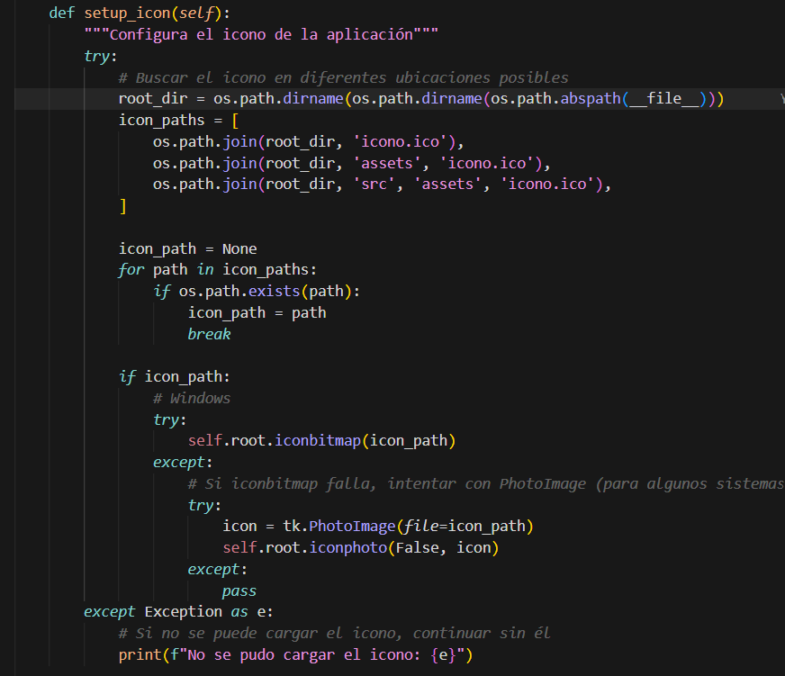  
  *Captura del método setup_icon() mostrando la búsqueda del icono.*

**Flujo de Ejecución:**

```
main() → App.__init__() → App.start() → LoginWindow → MainWindow
```

**[IMAGEN: diagrama_flujo_main.png]**  
*Diagrama de flujo mostrando el ciclo de vida de la aplicación desde main() hasta MainWindow.*

---

### 4.2. Configuración

#### 4.2.1. `config/config.py`

Archivo centralizado de configuración que define todos los parámetros de la aplicación.

**[IMAGEN: config/config.py - líneas 1-51]**  
*Captura completa del archivo de configuración.*

**Secciones de Configuración:**

1. **DB_CONFIG** (líneas 11-20): Configuración de la base de datos MySQL
   - Host, puerto, usuario, contraseña, nombre de BD
   - 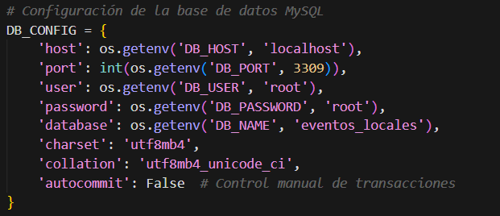  
*Captura de la configuración de base de datos.*

2. **APP_CONFIG** (líneas 23-30): Configuración de la aplicación
   - Título, versión, dimensiones de ventana
   - 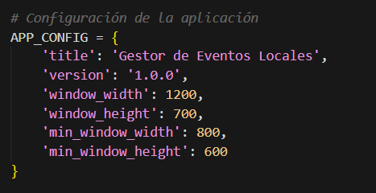  
*Captura de la configuración de la aplicación.*

3. **EXPORT_CONFIG** (líneas 33-38): Configuración de exportación
   - Encoding CSV, fuentes PDF
   - 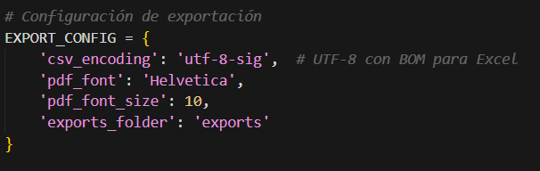  
*Captura de la configuración de exportación.*

4. **CONCURRENCY_CONFIG** (líneas 41-49): Configuración de concurrencia
   - Tamaño del pool, timeouts, reintentos
   - 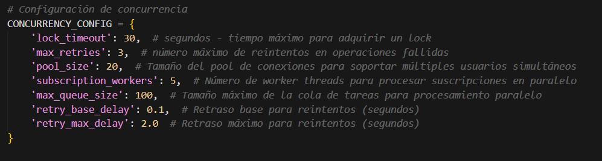  
*Captura de la configuración de concurrencia (muy importante para multiusuario).*

---

### 4.3. Base de Datos

#### 4.3.1. `src/database/db_connection.py`

Gestiona la conexión a MySQL usando un pool de conexiones para soportar múltiples usuarios simultáneos.

**[IMAGEN: src/database/db_connection.py - líneas 1-90]**  
*Captura completa del archivo de conexión a base de datos.*

**Clase Principal: `DatabaseConnection`**

**Patrón Singleton:**
- Implementa el patrón Singleton para garantizar una única instancia del pool
-   
*Captura del patrón Singleton con `__new__` y `_lock`.*

**Métodos Clave:**

1. **`_create_connection_pool()`** (líneas 42-57): Crea el pool de conexiones
   - 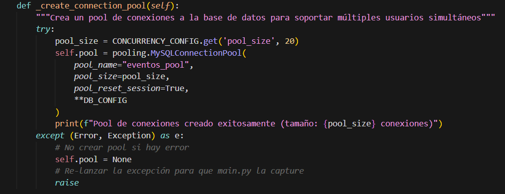  
    *Captura del método que crea el pool de conexiones MySQL.*

2. **`get_connection()`** (líneas 59-72): Obtiene una conexión del pool
   -  que permite a cada usuario tener su propia conexión.png)  
    *Captura del método get_connection() que permite a cada usuario tener su propia conexión.*

**Características del Pool:**
- Tamaño configurable (por defecto 20 conexiones)
- Permite múltiples usuarios simultáneos
- Gestión automática de conexiones

**[IMAGEN: diagrama_pool_conexiones.png]**  
*Diagrama mostrando cómo múltiples usuarios comparten el pool de conexiones.*

#### 4.3.2. `database/schema.sql`

Esquema completo de la base de datos con todas las tablas y relaciones.

**[IMAGEN: database/schema.sql - líneas 1-132]**  
*Captura completa del archivo SQL mostrando todas las tablas.*

**Tablas Principales:**

1. **`users`** (líneas 14-21): Usuarios del sistema
   - 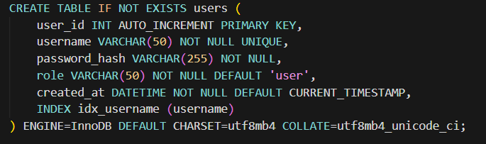  
     *Captura de la definición de la tabla users.*

2. **`events`** (líneas 24-40): Eventos
   - Incluye campo `version` para control de concurrencia optimista
   - 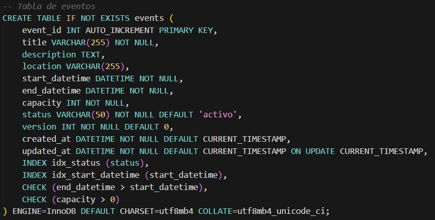  
     *Captura de la tabla events mostrando el campo version.*

3. **`participants`** (líneas 43-55): Participantes
   - 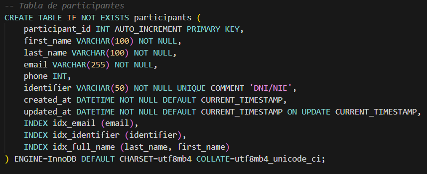  
     *Captura de la tabla participants.*

4. **`event_registrations`** (líneas 58-74): Inscripciones (relación N:M)
   - 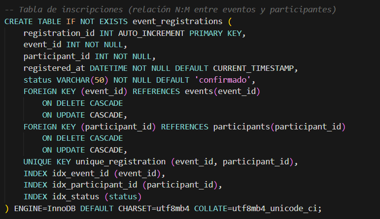  
     *Captura de la tabla event_registrations con las claves foráneas.*

5. **`audit_logs`** (líneas 77-91): Logs de auditoría
   - Registra todas las acciones realizadas por los usuarios
   - 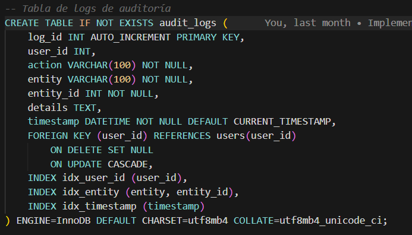  
     *Captura de la tabla audit_logs para registro de auditoría.*

**Diagrama ER:**

**[IMAGEN: diagrama_er.png]**  
*Diagrama Entidad-Relación mostrando las relaciones entre users, events, participants y event_registrations.*

---

### 4.4. Modelos de Datos

Los modelos representan las entidades del dominio de negocio.

#### 4.4.1. `src/models/user.py`

Modelo que representa un usuario del sistema.

**[IMAGEN: src/models/user.py - líneas 1-47]**  
*Captura completa del modelo User.*

**Estructura:**
- `user_id`: Identificador único
- `username`: Nombre de usuario
- `password_hash`: Hash de la contraseña (bcrypt)
- `role`: Rol del usuario ('admin' o 'user')
- `created_at`: Fecha de creación

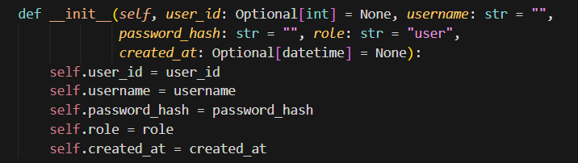  
*Captura del constructor de la clase User mostrando todos los atributos.*

**Métodos:**
- `to_dict()`: Convierte el objeto a diccionario
- `from_dict()`: Crea un objeto desde un diccionario

 y from_dict()..png)  
*Captura de los métodos to_dict() y from_dict().*

#### 4.4.2. `src/models/event.py`

Modelo que representa un evento.

**[IMAGEN: src/models/event.py - líneas 1-62]**  
*Captura completa del modelo Event.*

**Características Especiales:**
- Campo `version` para control de concurrencia optimista (línea 26)
-   
  *Captura del constructor mostrando el campo version.*

#### 4.4.3. `src/models/participant.py`

Modelo que representa un participante.

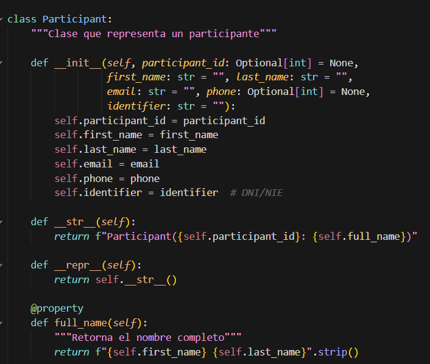  
*Captura completa del modelo Participant.*

**Propiedades:**
- `full_name`: Propiedad que retorna el nombre completo
- 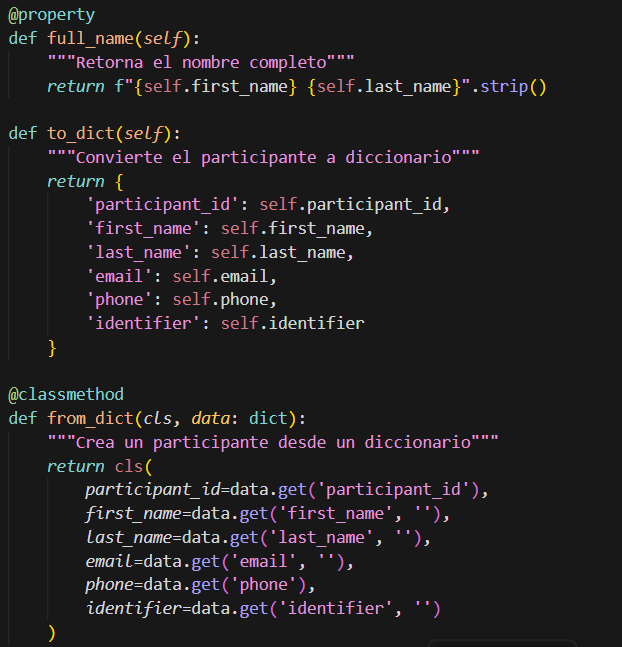  
  *Captura de la propiedad full_name.*

---

### 4.5. Controladores

Los controladores contienen la lógica de negocio y gestionan las operaciones CRUD.

#### 4.5.1. `src/controllers/auth_controller.py`

Controlador de autenticación. Gestiona login, registro y validación de credenciales.

**[IMAGEN: src/controllers/auth_controller.py - líneas 1-200]**  
*Captura completa del controlador de autenticación.*

**Métodos Principales:**

1. **`hash_password()`** (líneas 18-22): Genera hash bcrypt de contraseña
   - **[IMAGEN: src/controllers/auth_controller.py - líneas 18-22]**  
     *Captura del método hash_password() usando bcrypt.*

2. **`verify_password()`** (líneas 24-32): Verifica contraseña contra hash
   - **[IMAGEN: src/controllers/auth_controller.py - líneas 24-32]**  
     *Captura del método verify_password().*

3. **`login()`** (líneas 34-78): Autentica un usuario
   - **[IMAGEN: src/controllers/auth_controller.py - líneas 34-78]**  
     *Captura completa del método login() mostrando la validación y consulta a BD.*

4. **`register()`** (líneas 80-178): Registra un nuevo usuario
   - **[IMAGEN: src/controllers/auth_controller.py - líneas 80-178]**  
     *Captura del método register() mostrando todas las validaciones y la inserción en BD.*

**Flujo de Autenticación:**

```
Usuario → login() → Verificar BD → Verificar contraseña → Retornar datos usuario
```

**[IMAGEN: diagrama_flujo_login.png]**  
*Diagrama de flujo del proceso de autenticación.*

#### 4.5.2. `src/controllers/event_controller.py`

Controlador de eventos con gestión avanzada de concurrencia.

**[IMAGEN: src/controllers/event_controller.py - líneas 1-270]**  
*Captura completa del controlador de eventos.*

**Características de Concurrencia:**

1. **Control de Versiones Optimista** (líneas 160-166):
   - **[IMAGEN: src/controllers/event_controller.py - líneas 160-166]**  
     *Captura del UPDATE con control de versión (WHERE version = %s).*

2. **Locks de Recursos** (líneas 148-153):
   - **[IMAGEN: src/controllers/event_controller.py - líneas 148-153]**  
     *Captura del uso de ResourceLockManager para bloquear eventos específicos.*

3. **Reintentos con Backoff** (líneas 136-141):
   - **[IMAGEN: src/controllers/event_controller.py - líneas 136-141]**  
     *Captura del decorador @retry_with_backoff.*

**Métodos Principales:**

- `create()`: Crea un evento (solo admin)
- `get_all()`: Obtiene todos los eventos
- `update()`: Actualiza un evento con control de concurrencia
- `delete()`: Elimina un evento (solo admin)

**[IMAGEN: src/controllers/event_controller.py - líneas 52-91]**  
*Captura del método create() completo.*

#### 4.5.3. `src/controllers/registration_controller.py`

Controlador de inscripciones con gestión avanzada de concurrencia para evitar condiciones de carrera.

**[IMAGEN: src/controllers/registration_controller.py - líneas 1-357]**  
*Captura completa del controlador de inscripciones.*

**Características Avanzadas:**

1. **SELECT FOR UPDATE** (líneas 58-64): Bloqueo transaccional
   - **[IMAGEN: src/controllers/registration_controller.py - líneas 58-64]**  
     *Captura del SELECT FOR UPDATE que previene condiciones de carrera.*

2. **Nivel de Aislamiento REPEATABLE READ** (línea 53):
   - **[IMAGEN: src/controllers/registration_controller.py - líneas 51-54]**  
     *Captura de la configuración del nivel de aislamiento.*

3. **Procesamiento Paralelo** (líneas 312-355):
   - **[IMAGEN: src/controllers/registration_controller.py - líneas 312-355]**  
     *Captura del método register_multiple_participants_parallel() que usa worker threads.*

**Método Clave: `_register_participant_internal()`** (líneas 35-118)

Este método implementa todas las protecciones contra concurrencia:
- Lock de recurso
- SELECT FOR UPDATE
- Verificación de capacidad
- Verificación de duplicados

**[IMAGEN: src/controllers/registration_controller.py - líneas 35-118]**  
*Captura completa del método interno de registro mostrando todas las protecciones.*

#### 4.5.4. `src/controllers/participant_controller.py`

Controlador de participantes.

**[IMAGEN: src/controllers/participant_controller.py - líneas 1-297]**  
*Captura completa del controlador de participantes.*

**Método Especial: `find_by_username()`** (líneas 247-296)

Busca un participante asociado a un username usando múltiples estrategias:
1. Email exacto
2. Email que empiece con username@
3. Email donde la parte antes del @ sea igual a username

**[IMAGEN: src/controllers/participant_controller.py - líneas 247-296]**  
*Captura del método find_by_username() con las tres estrategias de búsqueda.*

#### 4.5.5. `src/controllers/user_controller.py`

Controlador de usuarios (gestión de usuarios del sistema).

**[IMAGEN: src/controllers/user_controller.py - líneas 1-225]**  
*Captura completa del controlador de usuarios.*

---

### 4.6. Vistas (Interfaz Gráfica)

Las vistas implementan la interfaz de usuario usando Tkinter.

#### 4.6.1. `src/views/login_window.py`

Ventana de inicio de sesión con diseño moderno.

**[IMAGEN: src/views/login_window.py - líneas 1-442]**  
*Captura completa de la ventana de login.*

**Estructura de la Interfaz:**

1. **Panel Izquierdo (Info)** (líneas 111-167):
   - **[IMAGEN: src/views/login_window.py - líneas 111-167]**  
     *Captura del método create_info_panel() que crea el panel informativo.*

2. **Panel Derecho (Login)** (líneas 169-323):
   - **[IMAGEN: src/views/login_window.py - líneas 169-323]**  
     *Captura del método create_login_panel() con los campos de usuario y contraseña.*

**Método de Login:** `handle_login()` (líneas 364-402)

**[IMAGEN: src/views/login_window.py - líneas 364-402]**  
*Captura del método handle_login() que valida credenciales y conecta a BD.*

**[IMAGEN: ventana_login.png]**  
*Captura de pantalla de la ventana de login en ejecución mostrando ambos paneles.*

#### 4.6.2. `src/views/main_window.py`

Ventana principal de la aplicación con menú lateral y área de contenido.

**[IMAGEN: src/views/main_window.py - líneas 1-765]**  
*Captura completa de la ventana principal (archivo largo, mostrar por secciones).*

**Componentes Principales:**

1. **Header** (líneas 245-285):
   - **[IMAGEN: src/views/main_window.py - líneas 245-285]**  
     *Captura del método create_header() con título y botón de cerrar sesión.*

2. **Sidebar (Menú Lateral)** (líneas 287-332):
   - **[IMAGEN: src/views/main_window.py - líneas 287-332]**  
     *Captura del método create_sidebar() con todos los items del menú.*

3. **Vista de Inicio** (líneas 353-561):
   - **[IMAGEN: src/views/main_window.py - líneas 353-561]**  
     *Captura del método show_home() que muestra estadísticas y próximos eventos.*

**[IMAGEN: ventana_principal.png]**  
*Captura de pantalla de la ventana principal mostrando el menú lateral y el contenido.*

#### 4.6.3. `src/views/event_view.py`

Vista completa de gestión de eventos con tabla, filtros y modales.

**[IMAGEN: src/views/event_view.py - líneas 1-100]**  
*Captura del inicio del archivo mostrando la clase EventView.*

**Componentes:**

1. **Tabla de Eventos** (líneas 100+):
   - **[IMAGEN: src/views/event_view.py - líneas 100-200]**  
     *Captura de la creación de la tabla Treeview con scrollbar.*

2. **Modal de Crear/Editar Evento**:
   - **[IMAGEN: src/views/event_view.py - líneas 250-400]**  
     *Captura del método que crea el modal con todos los campos del formulario.*

**[IMAGEN: vista_eventos.png]**  
*Captura de pantalla de la vista de eventos mostrando la tabla y los botones de acción.*

#### 4.6.4. `src/views/participant_view.py`

Vista de gestión de participantes.

**[IMAGEN: src/views/participant_view.py - líneas 1-100]**  
*Captura del inicio de la vista de participantes.*

**[IMAGEN: vista_participantes.png]**  
*Captura de pantalla de la vista de participantes.*

#### 4.6.5. `src/views/registration_view.py`

Vista de gestión de inscripciones.

**[IMAGEN: src/views/registration_view.py - líneas 1-100]**  
*Captura del inicio de la vista de inscripciones.*

**Características:**
- Diferentes permisos para admin vs usuario normal
- Búsqueda de eventos disponibles
- Gestión de inscripciones propias (usuarios normales)

**[IMAGEN: src/views/registration_view.py - líneas 24-39]**  
*Captura del constructor mostrando la lógica de búsqueda del participante asociado al usuario.*

**[IMAGEN: vista_inscripciones.png]**  
*Captura de pantalla de la vista de inscripciones.*

#### 4.6.6. `src/views/styles.py`

Archivo centralizado de estilos y colores.

**[IMAGEN: src/views/styles.py]**  
*Captura completa del archivo de estilos mostrando el diccionario COLORS.*

---

### 4.7. Utilidades

#### 4.7.1. `src/utils/validators.py`

Utilidades para validación de datos.

**[IMAGEN: src/utils/validators.py - líneas 1-56]**  
*Captura completa del archivo de validadores.*

**Métodos de Validación:**

- `validate_email()`: Valida formato de email
- `validate_dni_nie()`: Valida DNI/NIE español
- `validate_phone()`: Valida teléfono (9 dígitos)
- `validate_datetime_range()`: Valida rango de fechas
- `validate_capacity()`: Valida capacidad de eventos

**[IMAGEN: src/utils/validators.py - líneas 14-25]**  
*Captura de los métodos validate_email() y validate_dni_nie() con expresiones regulares.*

#### 4.7.2. `src/utils/exporters.py`

Utilidades para exportar datos a CSV y PDF.

**[IMAGEN: src/utils/exporters.py - líneas 1-355]**  
*Captura completa del archivo de exportadores.*

**Clases:**

1. **CSVExporter:**
   - `export_events()`: Exporta eventos a CSV
   - `export_participants()`: Exporta participantes a CSV

   **[IMAGEN: src/utils/exporters.py - líneas 23-55]**  
   *Captura de la clase CSVExporter con el método export_events().*

2. **PDFExporter:**
   - `export_events()`: Exporta eventos a PDF usando ReportLab
   - `export_participants()`: Exporta participantes a PDF
   - `export_registrations()`: Exporta inscripciones a PDF

   **[IMAGEN: src/utils/exporters.py - líneas 89-179]**  
   *Captura del método export_events() de PDFExporter mostrando la creación de tablas con ReportLab.*

#### 4.7.3. `src/utils/concurrency_manager.py`

**MÓDULO CRÍTICO:** Gestión avanzada de concurrencia para soportar múltiples usuarios simultáneos.

**[IMAGEN: src/utils/concurrency_manager.py - líneas 1-395]**  
*Captura completa del módulo de gestión de concurrencia.*

**Componentes Principales:**

1. **ResourceLockManager** (líneas 18-58):
   - Gestor de locks por recurso para sincronización granular
   - **[IMAGEN: src/utils/concurrency_manager.py - líneas 18-58]**  
     *Captura completa de la clase ResourceLockManager.*

2. **Decorador `retry_with_backoff`** (líneas 93-127):
   - Reintentos automáticos con backoff exponencial
   - **[IMAGEN: src/utils/concurrency_manager.py - líneas 93-127]**  
     *Captura del decorador retry_with_backoff con la lógica de reintentos.*

3. **ParallelSubscriptionProcessor** (líneas 130-311):
   - Procesador de suscripciones en paralelo usando worker threads
   - **[IMAGEN: src/utils/concurrency_manager.py - líneas 130-311]**  
     *Captura completa de la clase ParallelSubscriptionProcessor.*

   **Worker Loop** (líneas 193-221):
   - **[IMAGEN: src/utils/concurrency_manager.py - líneas 193-221]**  
     *Captura del método _worker_loop() que procesa tareas en paralelo.*

4. **EventNotificationSystem** (líneas 332-384):
   - Sistema de notificaciones asíncronas
   - **[IMAGEN: src/utils/concurrency_manager.py - líneas 332-384]**  
     *Captura del sistema de notificaciones.*

**Diagrama de Concurrencia:**

**[IMAGEN: diagrama_concurrencia.png]**  
*Diagrama mostrando cómo ResourceLockManager, ParallelSubscriptionProcessor y EventNotificationSystem trabajan juntos para gestionar múltiples usuarios simultáneos.*

---

## 5. Gestión de Concurrencia

### 5.1. Problema de Concurrencia

Cuando múltiples usuarios intentan realizar operaciones simultáneas (ej: inscribirse en un evento con capacidad limitada), pueden ocurrir:
- **Condiciones de carrera:** Dos usuarios se inscriben cuando solo queda 1 plaza
- **Lecturas sucias:** Un usuario ve datos inconsistentes
- **Pérdida de actualizaciones:** Una actualización sobrescribe otra

### 5.2. Soluciones Implementadas

#### 5.2.1. Control de Versiones Optimista

En `event_controller.py`, cada evento tiene un campo `version` que se incrementa en cada actualización:

```python
UPDATE events 
SET ..., version = version + 1
WHERE event_id = %s AND version = %s
```

Si `version` cambió, significa que otro usuario modificó el evento y se rechaza la actualización.

**[IMAGEN: src/controllers/event_controller.py - líneas 160-166]**  
*Captura del UPDATE con control de versión optimista.*

#### 5.2.2. Bloqueos Transaccionales (SELECT FOR UPDATE)

En `registration_controller.py`, se usa `SELECT FOR UPDATE` para bloquear un evento mientras se verifica la capacidad:

```sql
SELECT capacity, (SELECT COUNT(*) ...) as current
FROM events WHERE event_id = %s
FOR UPDATE
```

**[IMAGEN: src/controllers/registration_controller.py - líneas 58-64]**  
*Captura del SELECT FOR UPDATE que previene condiciones de carrera.*

#### 5.2.3. Locks de Recursos

`ResourceLockManager` permite bloquear recursos específicos (ej: evento_1, evento_2) de forma independiente:

```python
lock = _lock_manager.get_lock(f"event_{event_id}")
lock.acquire(timeout=30)
```

**[IMAGEN: src/utils/concurrency_manager.py - líneas 28-34]**  
*Captura del método get_lock() que obtiene o crea un lock para un recurso específico.*

#### 5.2.4. Nivel de Aislamiento REPEATABLE READ

Se configura el nivel de aislamiento de transacciones para evitar lecturas sucias:

```python
cursor.execute("SET TRANSACTION ISOLATION LEVEL REPEATABLE READ")
```

**[IMAGEN: src/controllers/registration_controller.py - línea 53]**  
*Captura de la configuración del nivel de aislamiento.*

#### 5.2.5. Reintentos con Backoff Exponencial

El decorador `@retry_with_backoff` reintenta operaciones fallidas con un retraso que aumenta exponencialmente:

**[IMAGEN: src/utils/concurrency_manager.py - líneas 110-121]**  
*Captura de la lógica de reintentos con backoff exponencial (delay = min(delay * 2, max_delay)).*

### 5.3. Flujo Completo de Inscripción con Concurrencia

```
Usuario 1 → Adquirir lock(event_1) → SELECT FOR UPDATE → Verificar capacidad → Insertar → Commit → Liberar lock
Usuario 2 → Esperar lock(event_1) → [Bloqueado hasta que Usuario 1 libere] → SELECT FOR UPDATE → ...
```

**[IMAGEN: diagrama_flujo_inscripcion_concurrencia.png]**  
*Diagrama de secuencia mostrando cómo dos usuarios se inscriben simultáneamente con todas las protecciones.*

---

## 6. Base de Datos

### 6.1. Esquema Completo

**[IMAGEN: database/schema.sql - líneas 1-132]**  
*Captura completa del archivo schema.sql.*

### 6.2. Relaciones

- **users** ← (1:N) → **audit_logs**
- **events** ← (1:N) → **event_registrations**
- **participants** ← (1:N) → **event_registrations**

**[IMAGEN: diagrama_relaciones_bd.png]**  
*Diagrama mostrando todas las relaciones entre tablas con cardinalidades.*

### 6.3. Índices

Los índices están optimizados para:
- Búsquedas por username (users)
- Búsquedas por email (participants)
- Búsquedas por fecha (events)
- Búsquedas por estado (event_registrations)

**[IMAGEN: database/schema.sql - líneas 20, 36-37, 52-54, 71-73]**  
*Captura de los índices definidos en las tablas.*

### 6.4. Datos de Ejemplo

El archivo `schema.sql` incluye datos de ejemplo para desarrollo (líneas 99-131):

**[IMAGEN: database/schema.sql - líneas 99-131]**  
*Captura de los INSERT IGNORE con datos de ejemplo.*

---

## 7. Instalación y Configuración

### 7.1. Requisitos Previos

- Python 3.8 o superior
- MySQL Server 8.0 o superior
- Windows (desarrollado para Windows, compatible con otros SO)

### 7.2. Instalación de Dependencias

1. Crear entorno virtual:
```bash
python -m venv venv
venv\Scripts\activate
```

2. Instalar dependencias:
```bash
pip install -r requirements.txt
```

**[IMAGEN: requirements.txt]**  
*Captura del archivo requirements.txt mostrando todas las dependencias.*

### 7.3. Configuración de Base de Datos

1. Crear base de datos MySQL
2. Ejecutar `database/schema.sql`:
```sql
mysql -u root -p < database/schema.sql
```

3. Configurar credenciales en `config/config.py` o crear archivo `.env`:
```
DB_HOST=localhost
DB_PORT=3309
DB_USER=root
DB_PASSWORD=root
DB_NAME=eventos_locales
```

**[IMAGEN: config/config.py - líneas 11-20]**  
*Captura de la configuración de base de datos mostrando cómo se cargan las variables de entorno.*

### 7.4. Ejecución

```bash
python src/main.py
```

**[IMAGEN: ejecucion_aplicacion.png]**  
*Captura de la terminal mostrando la ejecución de la aplicación y los mensajes de conexión al pool.*

---

## 8. Uso de la Aplicación

### 8.1. Login

1. Ejecutar la aplicación
2. Introducir credenciales:
   - Usuario: `ADMIN`
   - Contraseña: `ADMINISTRADOR`

**[IMAGEN: ventana_login_credenciales.png]**  
*Captura de la ventana de login con las credenciales de administrador ingresadas.*

### 8.2. Navegación

La aplicación tiene un menú lateral con las siguientes secciones:
- 🏠 Inicio
- 📅 Eventos
- 👤 Participantes
- 📝 Inscripciones
- 📊 Reportes
- ⚙️ Usuarios

**[IMAGEN: menu_lateral.png]**  
*Captura del menú lateral completo con todos los items.*

### 8.3. Gestión de Eventos

1. Ir a "Eventos"
2. Crear nuevo evento (solo admin)
3. Editar evento existente (solo admin)
4. Ver detalles y participantes inscritos

**[IMAGEN: crear_evento.png]**  
*Captura del modal de crear evento con todos los campos.*

### 8.4. Gestión de Participantes

1. Ir a "Participantes"
2. Crear nuevo participante (solo admin)
3. Buscar participantes
4. Ver eventos de un participante

**[IMAGEN: crear_participante.png]**  
*Captura del modal de crear participante.*

### 8.5. Inscripciones

**Para Administradores:**
- Inscribir cualquier participante en cualquier evento
- Ver todas las inscripciones
- Cambiar estado de inscripciones

**Para Usuarios Normales:**
- Inscribirse en eventos disponibles
- Ver sus propias inscripciones
- Cancelar sus inscripciones

**[IMAGEN: inscripcion_evento.png]**  
*Captura del proceso de inscripción mostrando la selección de evento y participante.*

### 8.6. Exportación de Datos

1. Ir a cualquier vista (Eventos, Participantes, Inscripciones)
2. Hacer clic en "Exportar CSV" o "Exportar PDF"
3. Seleccionar ubicación de guardado

**[IMAGEN: exportar_datos.png]**  
*Captura del diálogo de exportación y el archivo generado.*

### 8.7. Múltiples Usuarios Simultáneos

Para probar la funcionalidad multiusuario:

1. Abrir múltiples instancias de la aplicación
2. Iniciar sesión con diferentes usuarios
3. Intentar realizar operaciones simultáneas (ej: inscribirse en el mismo evento)
4. Verificar que no hay conflictos ni pérdida de datos

**[IMAGEN: multiples_usuarios.png]**  
*Captura de múltiples ventanas de la aplicación abiertas simultáneamente con diferentes usuarios.*

---

## 9. Conclusiones

### 9.1. Características Destacadas

- ✅ Arquitectura MVC bien estructurada
- ✅ Gestión avanzada de concurrencia para múltiples usuarios
- ✅ Interfaz gráfica intuitiva y moderna
- ✅ Sistema de autenticación seguro con bcrypt
- ✅ Exportación de datos a múltiples formatos
- ✅ Código bien documentado y organizado

### 9.2. Mejoras Futuras

- Implementar caché para mejorar rendimiento
- Añadir más tipos de reportes
- Implementar notificaciones por email
- Añadir gráficos y estadísticas visuales
- Implementar sistema de backup automático

---

## Anexos

### A. Glosario de Términos

- **Pool de Conexiones:** Conjunto de conexiones a BD reutilizables para mejorar rendimiento
- **Control de Versiones Optimista:** Técnica que usa un campo `version` para detectar conflictos
- **SELECT FOR UPDATE:** Bloqueo de filas en MySQL durante una transacción
- **Backoff Exponencial:** Estrategia de reintentos donde el retraso aumenta exponencialmente
- **Resource Lock:** Bloqueo específico para un recurso (ej: evento_1) independiente de otros

### B. Referencias

- Documentación de Python: https://docs.python.org/
- Documentación de MySQL: https://dev.mysql.com/doc/
- Documentación de Tkinter: https://docs.python.org/3/library/tkinter.html
- Documentación de bcrypt: https://pypi.org/project/bcrypt/
- Documentación de ReportLab: https://www.reportlab.com/docs/

---

**Fin de la Documentación**

